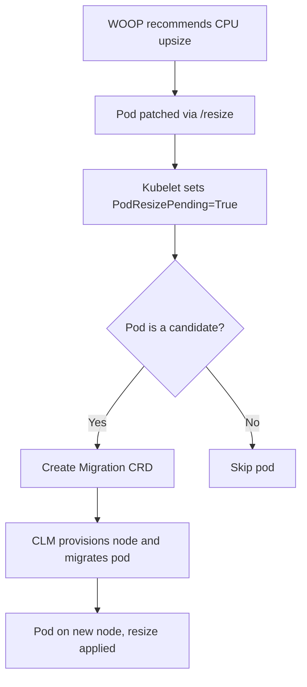
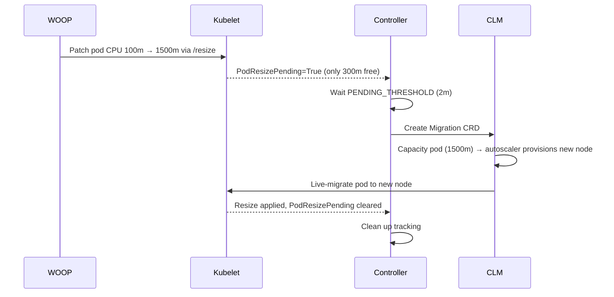

# castai-workload-resize-migrator

Detects when CAST AI Workload Autoscaler (WOOP) cannot apply a CPU upsize recommendation to a pod because the node is full, and triggers CAST AI Container Live Migration (CLM) by creating a `Migration` CRD. CAST AI CLM then provisions a suitable node and live-migrates the pod so the upsize can be applied.

---

## Table of Contents

- [Why](#why)
- [Architecture](#architecture)
- [How It Works](#how-it-works)
- [Prerequisites](#prerequisites)
- [Installation](#installation)
- [Configuration](#configuration)
- [Verification](#verification)
- [Troubleshooting](#troubleshooting)
- [Project Layout](#project-layout)

---

## Why

WOOP can recommend larger CPU requests for Coder pods, but if the node is full, Kubernetes defers the in-place resize (`desired > allocated`). The pod stays stuck at the old allocation. CAST AI Container Live Migration can move the pod to a node with enough room, allowing WOOP to apply the upsize.

This controller focuses only on **detecting the stuck resize** and **triggering the migration**. Node provisioning, capacity pod creation, checkpoint/restore, and live migration are handled by CAST AI CLM.

---

## Architecture



### What makes a pod a candidate?

A pod is a candidate for migration when all of these are true:

1. **CLM can migrate it** — the pod has the `live.cast.ai/migration-enabled=true` label, which CAST AI CLM adds automatically to pods it can live-migrate.

2. **The resize is stuck** — kubelet set `PodResizePending=True` on the pod, meaning the CPU upsize could not be applied because the node doesn't have enough free CPU.

3. **The resize won't resolve on its own** — one of:
   - `Infeasible` — the requested CPU is bigger than the node's total capacity. The pod can **never** get its resize on this node. Migration is triggered **immediately**.
   - `Deferred` — the requested CPU fits on the node in theory, but other pods are using the space right now. The controller waits `PENDING_THRESHOLD` (default 2 minutes) to give the node a chance to free up. If it's still stuck after that, migration is triggered.

If any of these conditions is not met, the pod is skipped.

### Example: Coder pod on a packed node



---

## How It Works

1. **Watches pods** via Kubernetes informers (event-driven).
2. **Filters** on `live.cast.ai/migration-enabled=true` label (auto-added by CLM to eligible pods).
3. **Scopes to source node templates** — when `SOURCE_NODE_TEMPLATES` is set, only pods running on nodes created from the listed CAST AI node templates are considered (node label `scheduling.cast.ai/node-template`). Empty means all pods.
4. **Checks `PodResizePending` condition** — set by kubelet when an in-place resize cannot be applied.
5. **Distinguishes by reason**:
   - `Infeasible` — requested CPU exceeds node's total capacity. The resize can **never** succeed on this node. Migration is triggered **immediately** via informer event — no threshold wait.
   - `Deferred` — node is temporarily full but could fit the resize later. Waits for `PENDING_THRESHOLD` (default 2m). Kubelet periodically retries Deferred resizes, updating the pod status and re-triggering the informer. When the threshold passes, migration is triggered **immediately** via informer event.
6. **Selects a destination node** — a live-migration-enabled node from the **same CAST AI node template** as the pod's current node (matching CPU generation — and since the template is required to be single-AZ, this also guarantees the same availability zone), excluding the source node. If no such node exists, the migration **fails safely**: nothing is created, an error is logged, and the pod is left untouched.
7. **Safety scan** runs every 2 minutes (configurable) as a **fallback only** — catches any pods missed during controller restart or informer cache gaps. This is NOT the primary trigger.
8. **Tracks** migration status and retries on failure (up to `MIGRATION_RETRY_LIMIT`).
9. **Cleans up** completed or permanently failed migrations from tracking.

---

## Prerequisites

### 1. Cluster requirements

- CAST AI-managed AWS EKS cluster running Kubernetes 1.30+
- In-place pod vertical scaling enabled (Kubernetes 1.33+ or feature gate `InPlacePodVerticalScaling`)
- CAST AI Container Live Migration (CLM) installed and enabled
- CAST AI autoscaler enabled with **Unschedulable Pods** policy turned on

### 2. CLM node template

The customer must create a CAST AI node template with Container Live Migration enabled:

- **Container Live Migration**: enabled
- **Processor architecture**: single (`amd64` or `arm64`, not "Any")
- **Compatible instance families**: from the same generation (e.g., c5, m5, r5)
- **Single subnet / single AZ**: CLM requires source and destination nodes in the same Availability Zone
- **Custom label**: `live.cast.ai/install=true`

> ⚠️ **Critical — instance family generation matters.** Live migration requires source and destination nodes to have identical host CPU capabilities. Use the *same CPU generation set* for all families in the template (e.g., c5+m5+r5). Mixing generations causes `CpuCapabilityMismatch` migration failures. Use the compatible-instance helper in the CAST AI console when configuring the template.

### 3. At least TWO CLM nodes (source + destination)

The controller migrates pods **between** CLM-enabled nodes — it never migrates onto the node the pod is already running on. If your cluster has only one live-migration-enabled node, migrations fail safely (nothing happens, an error is logged) until a second node from the same template and AZ exists.

Verify before enabling migrations:

```bash
kubectl get nodes -l live.cast.ai/migration-enabled=true
# You need at least 2 nodes, in the same AZ, from the same node template
```

If you only have one, create a lightweight second node with a helper deployment (set the template name in both places):

```yaml
apiVersion: apps/v1
kind: Deployment
metadata:
  name: clm-node2-spawner
  namespace: default
spec:
  replicas: 1
  selector:
    matchLabels:
      app: clm-node2
  template:
    metadata:
      labels:
        app: clm-node2
    spec:
      nodeSelector:
        scheduling.cast.ai/node-template: <your-clm-template-name>
      tolerations:
      - key: scheduling.cast.ai/node-template
        operator: Equal
        value: <your-clm-template-name>
        effect: NoSchedule
      containers:
      - name: placeholder
        image: nginx:latest
        resources:
          requests:
            cpu: 100m
            memory: 64Mi
```

### 4. WOOP apply mode

The controller complements CAST AI Workload Autoscaler (WOOP), which applies CPU recommendations via in-place resize. When a resize gets stuck:

- **Deferred apply mode** (recommended): WOOP leaves the stuck resize pending — the controller is the sole resolver. This is the intended configuration.
- **Immediate apply mode**: WOOP may fall back to evicting the pod to complete the resize via restart, racing the controller's migration. Prefer deferred mode for the policy covering in-scope workloads.

Check which mode is active:

```bash
kubectl logs -n castai-agent -l app.kubernetes.io/name=workload-autoscaler --tail=100 | grep immediate_mode
# "immediate_mode":false  → deferred (recommended)
```

### 5. Node configuration

The linked node configuration must use:

- **Image family**: `Amazon Linux 2023` (`FAMILY_AL2023`)
- **Container runtime**: `containerd`
- **Single subnet** (same AZ as source nodes)

### 6. Workload requirements

Source pods must:

- Be scheduled on nodes created from the CLM-enabled node template
- Have `resizePolicy` with `restartPolicy: NotRequired` for CPU
- Not use hard `kubernetes.io/hostname` node selectors (use `scheduling.cast.ai/node-template` instead)

---

## Installation

### Using Helm (recommended onboarding flow)

**Step 1 — install in dry-run mode first** (safe canary: the controller logs what it would migrate, but creates nothing):

```bash
helm install castai-workload-resize-migrator ./helm \
  --namespace castai-workload-resize-migrator \
  --create-namespace \
  --set config.dryRun=true \
  --set config.clmNodeTemplate=<your-clm-template-name> \
  --set config.sourceNodeTemplates=<your-clm-template-name>
```

**Step 2 — verify detection** while dry-run is active (generate load on a full node, or watch for stuck-resize pods):

```bash
kubectl logs -n castai-workload-resize-migrator deployment/castai-workload-resize-migrator -f | grep 'DRY-RUN'
```

**Step 3 — enable real migrations** once detection looks right:

```bash
helm upgrade castai-workload-resize-migrator ./helm \
  --namespace castai-workload-resize-migrator \
  --create-namespace \
  --set config.dryRun=false \
  --set config.clmNodeTemplate=<your-clm-template-name> \
  --set config.sourceNodeTemplates=<your-clm-template-name>
```

### Container image

The default image is `ghcr.io/ronakforcast/castai-workload-resize-migrator`. If it is not pullable from your cluster, build and push it to a registry the cluster can reach, then override:

```bash
--set image.repository=<your-registry>/castai-workload-resize-migrator --set image.tag=<tag>
```

### Using kubectl (without Helm)

```bash
kubectl apply -f k8s/deployment.yaml
```

---

## Configuration

| Parameter | Default | Description |
|---|---|---|
| `image.repository` | `ghcr.io/ronakforcast/castai-workload-resize-migrator` | Container image repository |
| `image.tag` | `0.1.0` | Container image tag |
| `image.pullPolicy` | `IfNotPresent` | Image pull policy |
| `replicaCount` | `1` | Number of replicas (leader election ensures single active) |
| `namespace` | `castai-workload-resize-migrator` | Namespace to deploy into |
| `config.dryRun` | `true` | If true, logs migrations but does not create CRDs |
| `config.pendingThreshold` | `2m` | How long a Deferred resize must be pending before triggering migration. Infeasible resizes skip this wait. |
| `config.safetyScanInterval` | `2m` | How often the fallback safety scan runs (NOT the primary trigger — migrations are event-driven) |
| `config.migrationTimeout` | `10m` | How long a migration is considered active before expiring |
| `config.migrationRetryLimit` | `3` | Max retries per failed migration |
| `config.migrationRetryDelay` | `30s` | Minimum delay before retrying a failed migration |
| `config.migrationAlertThreshold` | `3` | Migrations per workload per hour before alerting |
| `config.clmNodeTemplate` | `clm-live-migration-template` | Name of the CLM-enabled node template |
| `config.sourceNodeTemplates` | `""` (all pods) | Comma-separated CAST AI node template names. When set, only pods running on nodes created from these templates are considered for migration. Empty means all pods. |
| `config.leaderElection` | `true` | Enable leader election for HA |
| `resources.requests.cpu` | `50m` | CPU request |
| `resources.requests.memory` | `64Mi` | Memory request |
| `resources.limits.memory` | `256Mi` | Memory limit |

### Example: custom values

```yaml
# values.yaml
config:
  dryRun: false
  pendingThreshold: "1m"
  safetyScanInterval: "30s"
  migrationTimeout: "5m"
  migrationRetryLimit: 5
  migrationRetryDelay: "1m"
  clmNodeTemplate: "my-clm-template"

resources:
  requests:
    cpu: "100m"
    memory: "128Mi"
  limits:
    memory: "512Mi"
```

```bash
helm install castai-workload-resize-migrator ./helm \
  --namespace castai-workload-resize-migrator \
  --create-namespace \
  -f values.yaml
```

---

## Verification

1. Check controller logs:
   ```bash
   kubectl logs -n castai-workload-resize-migrator deployment/castai-workload-resize-migrator
   ```

2. Watch for created migrations:
   ```bash
   kubectl get migrations -A -w
   ```

3. Check migration status:
   ```bash
   kubectl describe migration <name> -n <namespace>
   ```

---

## Troubleshooting

| Issue | Fix |
|---|---|
| Migration fails with `PodSchedulingFailed` | Ensure source and destination nodes are in the **same AZ** (single subnet in node config) |
| Migration fails with `SubnetMismatch` | Add `topology.cast.ai/subnet-id` label to EKS-managed nodes, or use only CLM-provisioned nodes |
| Migration fails with `CpuCapabilityMismatch` ("source cpu capabilities do not match destination") | Source and destination nodes are on different host CPU generations or vendors. Restrict the node template's instance families to a **single CPU generation set** (e.g., all c5/m5/r5, or all n2/n2d) using the compatible-instance helper in the CAST AI console |
| Migration fails with `DestinationNodeNotEligible` ("scheduled node not compatible") | The named destination lacked capacity and CLM's capacity-pod flow re-selected an incompatible node. Restrict template families (see above) and ensure a second compatible node with free capacity exists |
| Migration fails with "same-node migration is not supported" | Controller version predates destination selection. Upgrade to ≥ 0.1.4 |
| Nothing happens — no migration, no logs | Check (a) ≥ 2 CLM-enabled nodes from the same template and AZ: `kubectl get nodes -l live.cast.ai/migration-enabled=true`, (b) `config.sourceNodeTemplates` matches the value of the `scheduling.cast.ai/node-template` label on your nodes, (c) `config.clmNodeTemplate` is set correctly |
| Capacity pod stuck Pending | Ensure the CLM node template allows large enough instances for the desired CPU |
| Controller detects no suspect pods | Ensure pods have `resizePolicy` and `PodResizePending` condition (requires in-place resize support) |
| Controller detects no suspect pods | Ensure pods have `live.cast.ai/migration-enabled=true` label (CLM adds this automatically to eligible pods) |
| Autoscaler doesn't provision nodes | Ensure **Unschedulable Pods** policy is enabled in CAST AI autoscaler settings |
| Migration keeps failing and retrying | Check if desired CPU fits on the destination node after ~500m system overhead |

---

## Project Layout

```
castai-workload-resize-migrator/
├── cmd/castai-workload-resize-migrator/   # Main entry point
├── pkg/
│   ├── config/                            # Environment-based config
│   ├── detector/                          # PodResizePending condition detection
│   └── migrator/                          # CAST AI Migration CRD creation + status tracking
├── helm/                                  # Helm chart
│   ├── Chart.yaml
│   ├── values.yaml
│   └── templates/
│       ├── _helpers.tpl
│       ├── namespace.yaml
│       └── deployment.yaml
├── k8s/
│   └── deployment.yaml                    # Plain k8s manifest (without Helm)
├── docs/
│   └── test-cases.md                      # Test cases and results
├── Dockerfile
└── README.md
```
