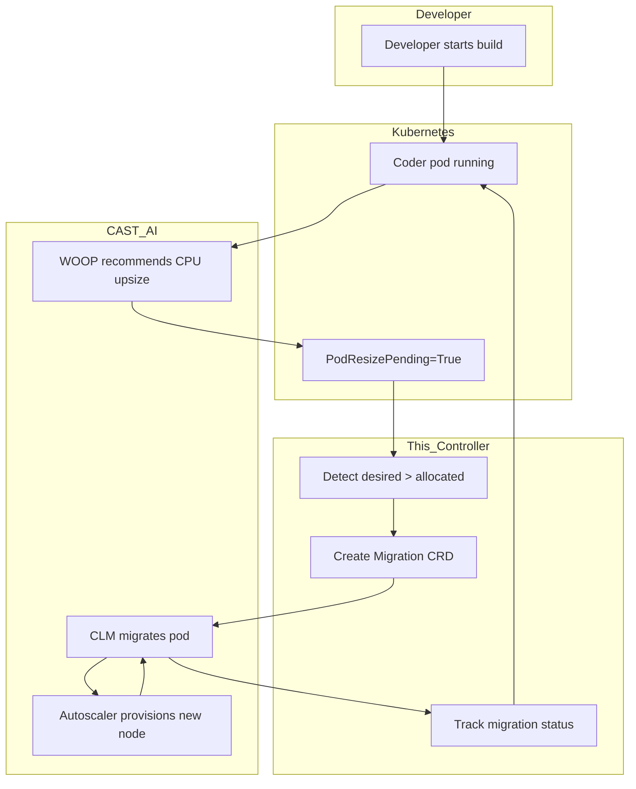

# Project Overview: CAST AI Workload Resize Migrator

Read this first if you are new to the project. It explains the problem we are solving, the goal, the solution, and the key concepts you need to understand before reading the code.

---

## TL;DR

When CAST AI Workload Autoscaler (WOOP) recommends a larger CPU request for a pod, but the node is too full to apply it via Kubernetes in-place resize, the pod gets stuck. This controller detects that stuck resize and triggers CAST AI Container Live Migration (CLM) by creating a `Migration` CRD. CLM then provisions a suitable node and live-migrates the pod so the upsize can be applied.

---

## 1. Problem Statement

### 1.1 What happens today

1. A Coder pod runs on a node that is efficiently packed by CAST AI.
2. A developer starts a build, CPU usage spikes.
3. CAST AI Workload Autoscaler (WOOP) recommends a CPU upsize (e.g., 100m → 1500m).
4. WOOP patches the pod via Kubernetes `/resize` subresource.
5. Kubelet tries to allocate the larger CPU request on the same node.
6. The node does not have enough free CPU.
7. Kubelet sets `PodResizePending=True` on the pod.
8. The pod stays stuck at the old CPU allocation.

### 1.2 Why this is bad

- The developer's build runs with insufficient CPU.
- Performance degrades even though WOOP correctly identified the need.
- The resize never applies unless something frees up the node (unlikely) or the pod is moved.

### 1.3 Root cause

Kubernetes in-place pod vertical scaling can change CPU requests without restarting a pod, **but only if the node has enough capacity**. When the node is full, the resize is deferred or becomes infeasible. WOOP itself does not move pods to make room.

---

## 2. Goal

> **Automatically detect pods whose CPU upsize recommendation is stuck due to node fullness, and trigger CAST AI Container Live Migration (CLM) so the pod is moved to a node where the upsize can be applied.**

### Non-goals

- We do not provision nodes ourselves.
- We do not perform checkpoint/restore or live migration ourselves.
- We do not change WOOP policies or organization-level settings.
- We do not handle memory upsizes in v1 (CPU only).

---

## 3. Solution Overview

This controller runs in the cluster and does three things:

1. **Watch pods** via Kubernetes informers.
2. **Detect stuck resizes** by comparing `spec.containers[].resources.requests.cpu` (desired) with `status.containerStatuses[].allocatedResources.cpu` (allocated). If `desired > allocated`, the resize is stuck.
3. **Create a `Migration` CRD** for each eligible stuck pod, which CAST AI CLM picks up and executes.

### 3.1 What CLM does after we create the Migration CRD

1. CLM creates a **capacity pod** (a scheduler probe) sized at the desired CPU.
2. If no existing node fits, the CAST AI autoscaler provisions a new node from a CLM-enabled node template.
3. CLM checkpoints the original pod, restores it on the new node, and migrates network connections.
4. The resize is applied on the new node.

### 3.2 Controller scope

| We do | We do not |
|---|---|
| Detect stuck resizes | Provision nodes |
| Create `Migration` CRDs | Create capacity pods |
| Track active migrations | Perform checkpoint/restore |
| Retry failed migrations (planned) | Evict pods |
| Annotate workloads when retry threshold exceeded (planned) | Change WOOP policies |

---

## 4. Key Concepts

### 4.1 CAST AI Workload Autoscaler (WOOP)

CAST AI's Workload Autoscaler continuously monitors workload metrics and adjusts resource requests up or down. In Kubernetes 1.33+ with in-place resize enabled, it can apply CPU recommendations without restarting the pod.

**Read:**
- [Workload Autoscaling Overview](https://docs.cast.ai/docs/workload-autoscaling-overview)
- [Workload Autoscaler Configuration](https://docs.cast.ai/docs/workload-autoscaling-configuration)
- [Settings Reference](https://docs.cast.ai/docs/woop-configuration-settings)

### 4.2 Kubernetes In-Place Pod Vertical Scaling

A Kubernetes feature (beta in 1.33, GA in 1.35+) that allows changing a pod's CPU/memory requests without restarting it. It uses the `/resize` subresource.

When a resize cannot be applied, kubelet sets `PodResizePending=True` with one of two reasons:

- **`Deferred`** — the node could fit the resize if other pods freed up space, but it cannot right now.
- **`Infeasible`** — the requested CPU is larger than the node's total capacity. It can never fit.

**Read:**
- [KEP-1287: In-Place Update of Pod Resources](https://github.com/kubernetes/enhancements/tree/master/keps/sig-node/1287-in-place-update-pod-resources)
- [Kubernetes 1.33 In-Place Pod Resize Beta](https://kubernetes.io/blog/2025/05/16/kubernetes-v1-33-in-place-pod-resize-beta/)

### 4.3 CAST AI Container Live Migration (CLM)

CLM moves running pods between nodes with zero downtime using checkpoint/restore technology. It preserves memory state, process state, and network connections.

A pod is eligible for CLM if it has the `live.cast.ai/migration-enabled=true` label, which CLM adds automatically.

**Read:**
- [Container Live Migration Overview](https://docs.cast.ai/docs/clm-overview)
- [Getting Started with CLM](https://docs.cast.ai/docs/clm-getting-started)
- [CLM Requirements and Limitations](https://docs.cast.ai/docs/clm-requirements-and-limitations)
- [CLM Labels, Annotations, and Events](https://docs.cast.ai/docs/clm-reference-labels-and-annotations)

### 4.4 CAST AI Node Templates

Node templates define what kinds of nodes the CAST AI autoscaler can create. For CLM to work, the node template must have:

- **Container Live Migration enabled** (`clmEnabled: true`)
- Single processor architecture (not "Any")
- Compatible instance families from the same generation
- Custom label `live.cast.ai/install=true`

**Read:**
- [Node Templates](https://docs.cast.ai/docs/node-templates)
- [CLM Getting Started → Configure Node Templates](https://docs.cast.ai/docs/clm-getting-started)

---

## 5. Architecture



### 5.1 Trigger signal

The controller's core signal is:

```
pod.spec.containers[*].resources.requests.cpu  >  pod.status.containerStatuses[*].allocatedResources.cpu
```

When this is true, the pod's desired CPU is larger than what kubelet could actually allocate.

### 5.2 Why we use Migration CRDs instead of the rebalance API

We originally considered the CAST AI rebalance API, but pivoted to Migration CRDs because:

- Migration CRDs are native Kubernetes objects.
- No CAST AI API key is needed.
- CLM can trigger node provisioning when a CLM-enabled node template exists.
- One Migration CRD per pod is simpler than the rebalance API's 50-node limit.

---

## 6. Required Reading for New Contributors

Read these in order:

1. [Workload Autoscaling Overview](https://docs.cast.ai/docs/workload-autoscaling-overview) — understand WOOP.
2. [Kubernetes 1.33 In-Place Pod Resize Beta](https://kubernetes.io/blog/2025/05/16/kubernetes-v1-33-in-place-pod-resize-beta/) — understand the resize mechanism and `PodResizePending`.
3. [Container Live Migration Overview](https://docs.cast.ai/docs/clm-overview) — understand CLM.
4. [CLM Requirements and Limitations](https://docs.cast.ai/docs/clm-requirements-and-limitations) — understand node/runtime requirements.
5. [Node Templates](https://docs.cast.ai/docs/node-templates) — understand how to configure CLM-enabled templates.
6. [agent_test.md](./agent_test.md) — how to reproduce all tests.

---

## 7. When This Solution Applies

### ✅ Applies when

- Cluster runs Kubernetes 1.35+ with in-place resize enabled.
- CAST AI WOOP is enabled and recommends CPU upsizes.
- CAST AI CLM is installed with a CLM-enabled node template.
- Workloads can be live-migrated (`live.cast.ai/migration-enabled=true`).
- Pods use `resizePolicy` with `restartPolicy: NotRequired` for CPU.

### ❌ Does not apply when

- Cluster runs Kubernetes < 1.33 (no in-place resize support).
- CLM is not installed or no CLM-enabled node template exists.
- Pods have hard `kubernetes.io/hostname` node selectors.
- Pods cannot use containerd or are not in a single AZ/subnet.

---

## 8. Known Limitations

- Migration does not directly create a node. It creates a capacity pod; the CAST AI autoscaler provisions the node.
- Without a CLM-enabled node template, the capacity pod cannot be scheduled.
- EKS-managed nodes need the `topology.cast.ai/subnet-id` label or migration may fail with `SubnetMismatch`.
- Hard hostname node selectors break capacity pod scheduling.
- End-to-end automated validation (controller → Migration CRD → CLM → resize applied) is not yet complete.

---

## 9. Next Steps

1. Run the full in-cluster non-dry-run test.
2. Validate end-to-end: resize stuck → Migration CRD → node provisioning → live migration → resize applied.
3. Implement and test migration retry logic.
4. Implement alert threshold annotations on workloads.
5. Build and push a production container image.

---

## 10. Quick Glossary

| Term | Meaning |
|---|---|
| **WOOP** | CAST AI Workload Autoscaler |
| **CLM** | CAST AI Container Live Migration |
| **WOO** | Shorthand for Workload Autoscaler (older naming) |
| **In-place resize** | Changing pod CPU/memory without restart |
| **`PodResizePending`** | K8s condition set when resize cannot be applied |
| **`Deferred`** | Resize temporarily blocked by node capacity |
| **`Infeasible`** | Resize can never fit on the current node |
| **Capacity pod** | CLM's scheduler probe pod with desired resources |
| **Migration CRD** | `live.cast.ai/v1 Migration` resource created by this controller |
